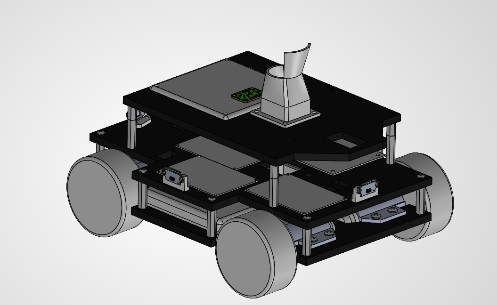
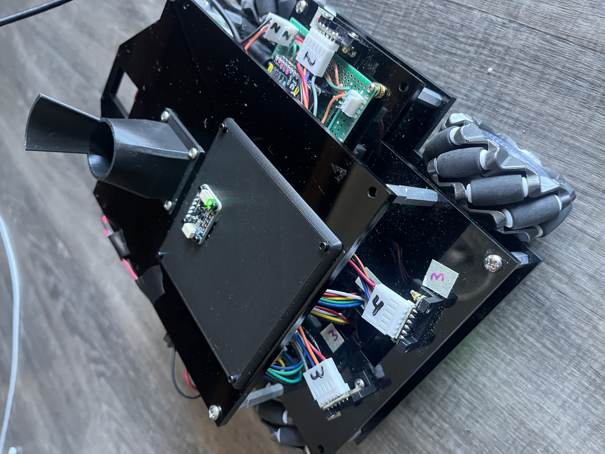
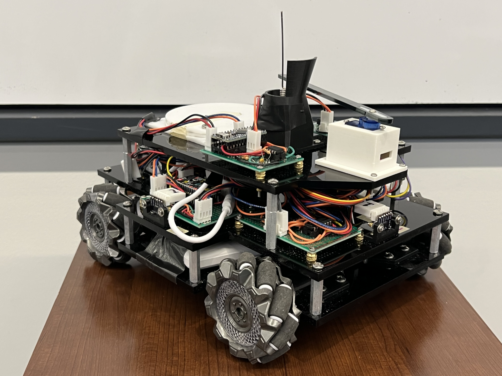
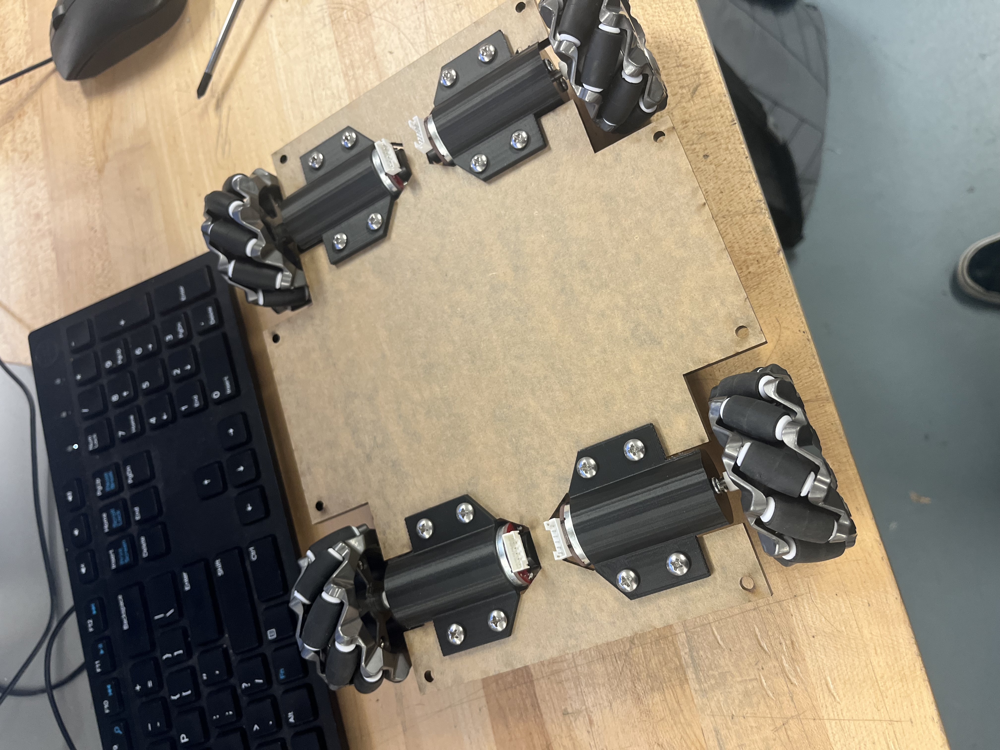
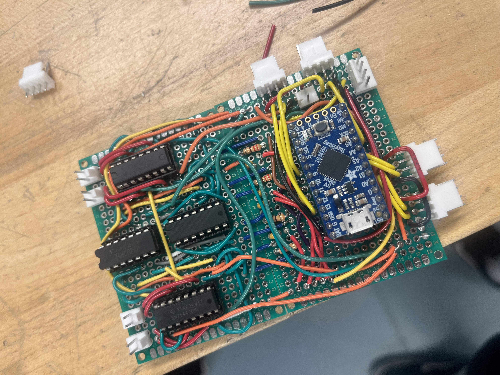
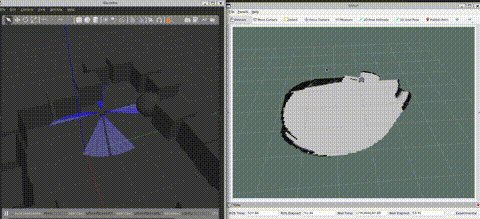
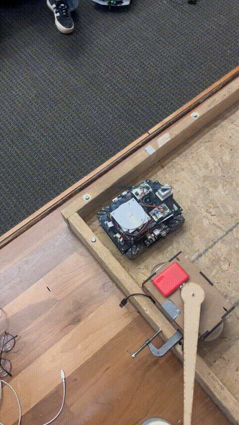

# Autonomous Mecanum-Wheel Robot: Sparse SLAM, Simulation & Embedded Systems

An omnidirectional mobile robot that explores and maps unknown indoor spaces using only **five single-zone time-of-flight sensors**. The project spans a Gazebo simulation with realistic sensor drift, a custom C++ mapping, localization and navigation stack on ROS 2 Humble, and ESP-IDF firmware that streams the physical robot's sensors over WiFi with micro-ROS.

Originally built for MEAM 5100 (Mechatronics) at the University of Pennsylvania, the robot has since been extended into a full autonomous exploration platform with a sim-to-real pipeline.

## Status

| Capability | Simulation | Hardware |
|---|---|---|
| Frontier exploration (A\*, smoothing, explore/refine cycles) | Yes | Not yet, firmware has no `cmd_vel` input |
| Occupancy-grid mapping (ToF cone sensor model) | Yes | Yes |
| EKF: wheel odometry + IMU | Yes | Yes, velocities and heading verified |
| Heading correction from wall directions | Yes | Not yet, needs autonomous spins |
| Correlative scan matching | dry run only ([why](#why-scan-matching-is-dry-run)) | — |
| Sensor + odometry streaming over WiFi (micro-ROS) | — | Yes, ~20 Hz per ToF sensor, clock-synced |

## System Architecture

```
Physical Robot (ESP32-C3)                         PC (WSL2 / Ubuntu 22.04, ROS 2 Humble)
┌───────────────────────────────┐                ┌──────────────────────────────────────┐
│ 5x VL53L0X ToF (~20 Hz each)  │                │ micro-ROS agent (UDP 9999)           │
│ LSM6DS3TR-C + LIS3MDL 9-DOF   │   WiFi / UDP   │   │                                  │
│   Madgwick filter (w/ mag)    │ ─────────────► │ tof_splitter ─► 5 per-sensor topics  │
│ Wheel dead reckoning (I2C)    │  /imu/data     │ EKF (robot_localization)             │
│ micro-ROS: clock sync,        │  /tof/range    │   wheel velocities + IMU heading     │
│   auto-reconnect              │  /odom         │   ─► odom → base_link                │
│ Joins home WiFi, falls back   │                │ sparse_slam                          │
│   to its own access point     │                │   cone-model occupancy grid          │
└───────────────────────────────┘                │   wall-direction heading correction  │
                                                 │   ─► map → odom, /map                │
                                                 │ navigator (sim only, for now)        │
                                                 │   frontiers + A* ─► /cmd_vel         │
                                                 └──────────────────────────────────────┘
```

## Hardware

- **Chassis:** 3-tier laser-cut acrylic (8" x 10" footprint), custom 3D-printed motor mounts and sensor brackets, designed in SolidWorks





- **Drivetrain:** 4 mecanum wheels with independent DC motors for omnidirectional movement (forward, strafe, rotation)



- **Main controller:** ESP32-C3 (M5Stamp C3, RISC-V, 160 MHz)
- **Motor controller:** ItsyBitsy ATmega32U4 over I2C; also reports wheel dead-reckoning increments
- **Sensors:**
  - 5x VL53L0X time-of-flight sensors (I2C, address-sequenced via a D flip-flop shift register)
  - Adafruit LSM6DS3TR-C + LIS3MDL 9-DOF IMU with an onboard Madgwick orientation filter
  - Wheel encoders for dead reckoning
- **Electronics:** Hand-soldered perfboard with Molex/XT60 connectors; custom SN754410 H-bridge motor driver with AND/NOR-gate complementary PWM generation



## Repository Structure

```
mecanum_ws/
├── src/mecanum_robot/                # ROS 2 package
│   ├── src/
│   │   ├── sparse_slam.cpp           # Mapping, heading correction, scan matcher (dry run), spin recording
│   │   └── navigator.cpp             # Frontier exploration, A*, path smoothing, explore/refine state machine
│   ├── launch/
│   │   ├── gazebo.launch.py          # Full simulation (args: gui:=false, seed:=N)
│   │   ├── real.launch.py            # Real robot: agent, TF, EKF, ToF splitter, mapping
│   │   └── display.launch.py         # URDF viewer
│   ├── config/
│   │   ├── ekf.yaml                  # EKF for simulation
│   │   └── ekf_real.yaml             # EKF for hardware
│   ├── scripts/
│   │   ├── odom_noise.py             # Sim: turns Gazebo's perfect odometry into drifting dead reckoning
│   │   ├── imu_relay.py              # Sim: adds realistic heading drift to the IMU
│   │   ├── pose_error.py             # Sim: estimate vs ground truth, logs and run summaries
│   │   ├── tof_splitter.py           # Hardware: /tof/range -> one topic per sensor
│   │   └── twist_relay.py            # Velocity axis remapping
│   ├── tools/                        # Offline analysis (see "Evaluation tools")
│   ├── urdf/ meshes/ worlds/
└── firmware/                         # ESP-IDF firmware for the ESP32-C3
    ├── main/
    │   ├── main_controller.cpp       # Sensors, Madgwick, dead reckoning, motors, micro-ROS
    │   └── wifi_secrets.h.example    # Copy to wifi_secrets.h (gitignored) for home-WiFi mode
    ├── app-colcon.meta               # micro-ROS build limits (publishers/subscriptions)
    └── components/                   # Arduino-as-component, micro-ROS component
```

## Simulation

The Gazebo Classic simulation mirrors the physical robot: a custom URDF with SolidWorks meshes, five ray-sensor plugins modelling the VL53L0X's 25° cone, an IMU plugin, and planar-move mecanum kinematics.

The simulation is deliberately **made as imperfect as the real robot**, so that algorithms are tested against realistic error:

- **`odom_noise.py`** integrates Gazebo's true motion with a forward/strafe scale error and random walk, producing dead-reckoning drift.
- **`imu_relay.py`** adds heading bias, a rotation scale error and random walk to the otherwise perfect simulated IMU.
- **`pose_error.py`** compares the robot's best estimate (TF `map → base_link`) against Gazebo ground truth, publishes the error for plotting, and prints a run summary on shutdown.

### Running the simulation

```bash
# Terminal 1: build and start everything (Gazebo, EKF, mapping, navigator, drift injection)
gazebo_start                     # or: ros2 launch mecanum_robot gazebo.launch.py [gui:=false] [seed:=N]

# Terminal 2: visualize
source /opt/ros/humble/setup.bash && source ~/mecanum_ws/install/setup.bash
rviz2 --ros-args -p use_sim_time:=true
# Fixed Frame: map. Add Map (/map) and RobotModel (/robot_description).
```

`gui:=false` runs Gazebo headless. `seed:=N` gives each run its own drift pattern, which is useful for batches (`tools/batch_runs.sh`).

## Mapping and Localization

### Occupancy grid with a cone sensor model

The map is a 400 x 400 log-odds occupancy grid at 5 cm resolution (20 m x 20 m). A VL53L0X reports the **nearest** obstacle anywhere inside its ~25° cone, so each reading is inserted as:

- **free:** every cell inside the cone closer than the measured range
- **occupied:** the cells along the arc at the measured range

Wrong arc cells are carved back to free by overlapping readings, so only real surfaces keep accumulating evidence. Treating readings as thin centre-line rays instead put half of all hits 10+ cm short of the true surface. The cone model raised the share of map walls within 5 cm of a real surface from 40% to 56%.

### Heading correction from wall directions

Heading drift is the dominant source of error, so `sparse_slam` corrects heading using the walls themselves:

1. **Regions of Constant Depth** (Leonard & Durrant-Whyte): as a cone sweeps across a flat wall during the robot's 360° spins, the range stays constant for one cone width. The centre of that plateau points along the wall's normal, with a median error of 0.66° against the true world.
2. Sightings from one spin are grouped into **distinct features**, since five sensors often see the same corner. Features are associated with a stored **wall map** by direction and position.
3. The heading measurement is the median direction difference over known walls, with a **Manhattan-world fallback** (walls at 90° to each other) while exploring new territory.
4. A **1-D Kalman filter** weighs each measurement against the current heading uncertainty, rejects outliers beyond 3σ, and inflates its uncertainty after rejections so that it can't lock itself out.

Each correction rotates the `map → odom` transform about the robot. The room's wall axes are learned from the first clear spin, so the robot can start at any angle.

**Results**, live in simulation, 5 seeded runs against EKF-only runs of the same seeds:

| | EKF only | With wall correction |
|---|---|---|
| Heading error, mean per run | 3.5–5.2° | 2.9–4.0° |
| Position error, mean per run | 0.16–0.28 m | 0.12–0.20 m |

Every seed improved on both measures, with no harmful corrections.

### Why scan matching is dry-run

A correlative scan matcher (arc scoring, free-space penalty, motion prior, ambiguity check) is implemented and runs every spin, but by default only **logs** its results (`match_apply:=false`). Offline replay against ground truth showed that a single spin from five wide cones constrains rotation to only about ±4°, while drift is about 1° per spin, and a single false match corrupts the map. Wall-direction features turned out to be a far better use of the same sensor data.

## Navigation

- **Frontier detection:** flood-fill clustering of free cells next to unknown space
- **Target selection:** nearest frontier cell beyond a minimum distance; targets that fail planning are skipped
- **A\* planning:** 8-connected grid search with obstacle inflation; inflation around the start cell is cleared so the robot can always leave a wall
- **Line-of-sight smoothing:** Bresenham visibility checks remove unnecessary waypoints
- **Explore/refine state machine:** 360° scans at frontiers, plus mid-drive scans only when enough unexplored frontier is nearby
- **Reactive safety:** sustained backup and rescan when any ToF reading drops below 10 cm
- Waits for the map to include each spin before choosing the next frontier



## Sensor Fusion

robot_localization EKF in 2D mode. Wheel odometry is fused as **robot-frame velocities only**, so the EKF integrates them with the IMU's heading, and wheel slip while turning doesn't corrupt the heading.

| Source | Fused | Notes |
|---|---|---|
| Wheel odometry (`/odom`) | vx, vy | firmware publishes robot-frame velocities |
| IMU (`/imu/data`) | yaw, yaw rate | Madgwick with magnetometer on hardware |

## Firmware

ESP-IDF v5.3 with Arduino as a component and micro-ROS over WiFi:

- **Cooperative scheduler:** timed handlers (IMU 10 ms, dead reckoning 25 ms, ToF 20 ms, publishing 50 ms), with an optional per-handler timing report (`DEBUG_TIMING`)
- **Madgwick filter** with gyro auto-calibration and magnetometer; direct I2C register access
- **ToF:** every reading is published as soon as it arrives (~20 Hz per sensor), **stamped when it was measured**. Sensors that fail to start are skipped, so they can't stall the loop on I2C timeouts.
- **Odometry:** wheel increments published as robot-frame velocities in ROS conventions (+x right, +y forward, counterclockwise yaw)
- **micro-ROS:**
  - clock synced with the agent, so stamps are in ROS time
  - best-effort sensor streams; reliable odometry, which needs fragmentation
  - background connect with a quick ping, and automatic reconnect when the agent restarts
- **WiFi:** joins your home network (laptop keeps internet), falling back to its own `MecanumRobot` access point if that's unavailable

### Building and flashing

```bash
cp firmware/main/wifi_secrets.h.example firmware/main/wifi_secrets.h   # optional: home WiFi + laptop IP
esp_flash          # helper in ~/.bashrc: build, flash, monitor
```

`esp_flash` runs ESP-IDF in a subshell. Sourcing ESP-IDF's `export.sh` directly in a terminal puts its own `python3` first on `PATH`, which breaks ROS tools in that terminal (see Troubleshooting).

## Running on the Real Robot

```bash
ros2 launch mecanum_robot real.launch.py      # agent, TF, ToF splitter, EKF, mapping
rviz2                                         # wall-clock time; Fixed Frame: map
```

On WSL2, attach the ESP32 with `usbipd attach --wsl --busid <BUSID> --auto-attach` (only needed for flashing), and allow UDP 9999 through the Windows firewall for the agent.

## Evaluation Tools

`src/mecanum_robot/tools/` holds the offline analysis used to develop the localization:

| Tool | Purpose |
|---|---|
| `batch_runs.sh` | headless exploration runs, one per noise seed |
| `slam_report.py` | per-spin summary of matcher decisions vs ground truth from the logs |
| `slam_replay.py` | replays recorded spins (`slam_records/`): plots scans against the map and the true world, scores the matcher offline |
| `rcd_check.py` | Region-of-Constant-Depth extraction and wall-bearing accuracy |
| `wall_heading.py` | offline prototype of the heading corrector, replayed spin by spin |

Every run records its spins (rays, map crop, matcher decision) and ground truth to `slam_records/<timestamp>/`.

## Troubleshooting

| Symptom | Cause | Fix |
|---|---|---|
| Robot doesn't spawn; `No module named 'lxml'` | ESP-IDF's Python leaked into the terminal | open a new terminal (`esp_flash` now uses a subshell) |
| No Gazebo window; robot missing; TF "unconnected trees" | leftover `gzserver` or launch from an earlier run | `gazebo_start` now kills leftovers first |
| RViz frozen after restarting Gazebo | sim time restarted from zero | click **Reset** in RViz |
| RViz "Error loading geometries" | workspace not sourced in RViz's terminal | `source ~/mecanum_ws/install/setup.bash` before `rviz2` |
| Robot message stamps off by seconds; EKF distances wrong | WSL clock stepped by two time services | `sudo systemctl disable --now systemd-timesyncd`; WSL follows Windows time |
| Real robot connected but no data after many reboots | stale micro-ROS sessions in the agent | restart `real.launch.py` |

## Known Limitations and Future Work

- **`cmd_vel` in the firmware:** the last blocker for autonomous exploration on hardware
- **Corner vs face classification** across spins, so wall-face measurements can be trusted more
- **Navigator:** mark targets as failed after repeated backups, since the robot can loop beside an obstacle
- **Odometry calibration under power:** a hand-push test gives 0.98 m for 1.00 m
- **Sensor upgrade path:** VL53L5CX multi-zone ToF or a 2D lidar would make full scan-matching SLAM practical
- **Docker:** containerized simulation stack for reproducible builds

## Demos

The wall following algorithm takes advantage of omnidirectional movement by strafing with the target wall in front of or behind the robot.



## Dependencies

### PC (Ubuntu 22.04 / WSL2)
- ROS 2 Humble, Gazebo Classic 11, robot_localization, xacro, joint_state_publisher
- micro-ROS agent (built in a separate workspace)
- Python 3 with numpy, scipy and matplotlib (evaluation tools)

### Firmware
- ESP-IDF v5.3.2
- Arduino-ESP32 v3.1.1 (as an ESP-IDF component)
- micro-ROS ESP-IDF component
- Adafruit VL53L0X, BusIO and Sensor libraries

## Author

Built by Mark William Gellar
